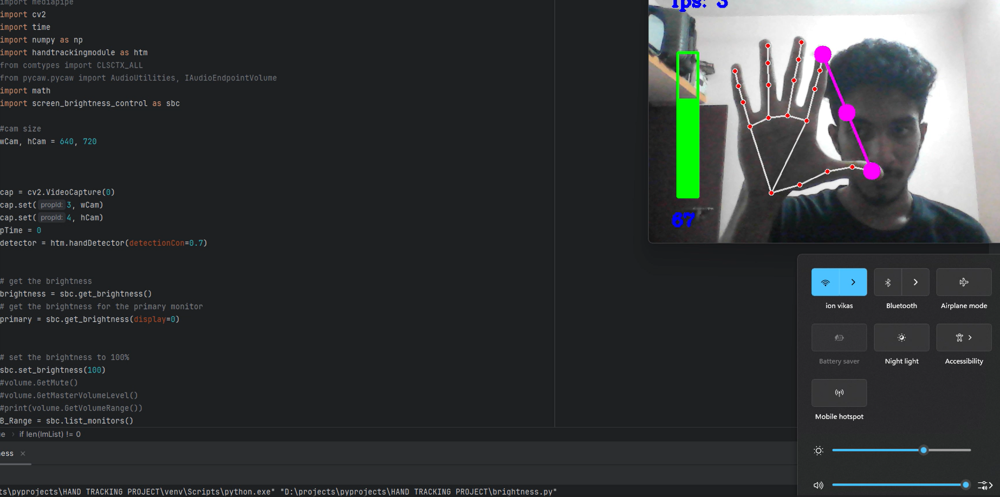

## Gesture Control Brightness



### Overview

This GitHub repository contains a Gesture Control Brightness project that enables you to adjust your laptop's brightness using hand gestures. The system utilizes OpenCV for computer vision, MediaPipe for hand tracking, and the `screen_brightness_control` module to dynamically change the laptop's brightness based on hand gestures.

### Features

- Hand tracking using custom hand tracking module.
- Gesture recognition for thumb and index finger movements.
- Real-time adjustment of laptop brightness based on hand proximity.

### Requirements

Make sure you have the following dependencies installed:

- Python 3.x
- OpenCV
- MediaPipe
- screen_brightness_control

Install the dependencies using the following command:

```bash
pip install opencv-python mediapipe screen-brightness-control
```

### Usage

1. Clone the repository:

```bash
git clone https://github.com/your-username/gesture-control-brightness.git
cd gesture-control-brightness
```

2. Run the main script:

```bash
python main.py
```

3. The webcam feed will start, and hand tracking will begin. Adjust your laptop brightness by bringing your thumb and index finger closer or farther apart.

### Custom Hand Tracking Module

This repository includes a custom hand tracking module that enhances the hand tracking capabilities. You can find the module in the `hand_tracking_module.py` file.

### Configuration

You can configure the project settings in the `config.py` file, including camera parameters, hand tracking thresholds, and brightness adjustment values.

### Acknowledgments

This project uses the following libraries:

- [OpenCV](https://github.com/opencv/opencv)
- [MediaPipe](https://github.com/google/mediapipe)
- [screen_brightness_control](https://github.com/Crozzers/screen-brightness-control)

### Contributions

Contributions are welcome! If you find any issues or want to improve the project, feel free to create a pull request.


### Author

VIKAS M
vikasm7146@gamil.com

Feel free to reach out if you have any questions or suggestions!
